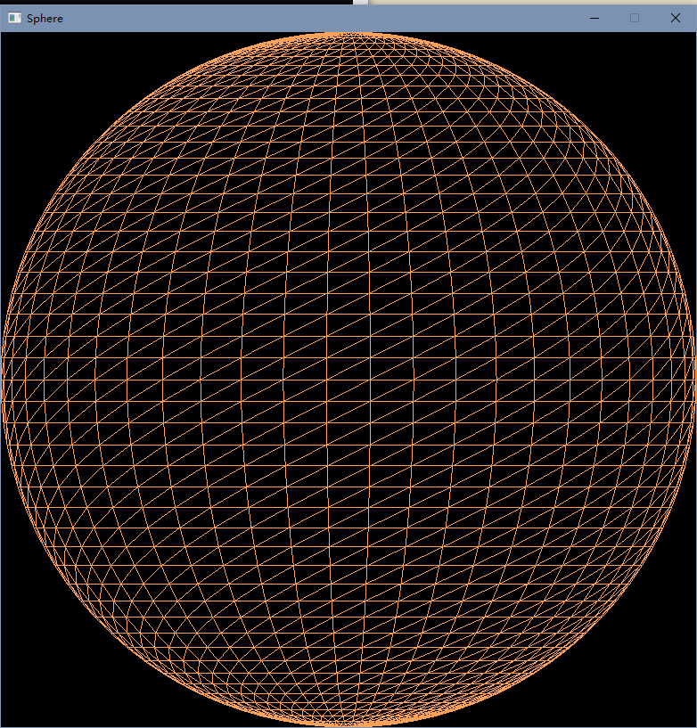
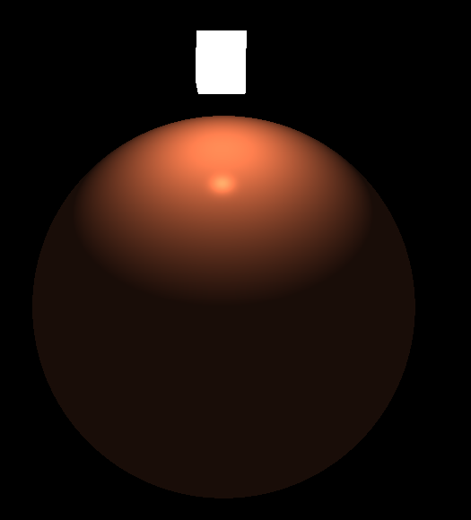
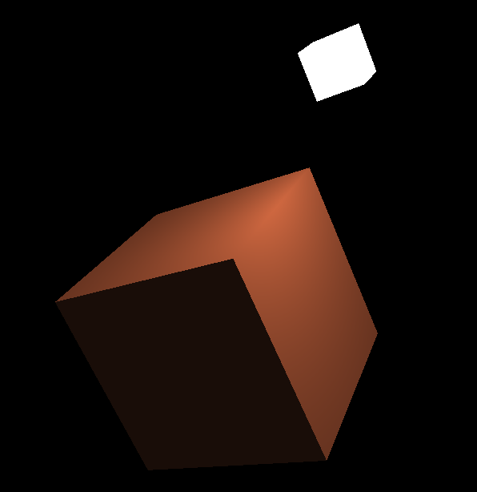

# OpenGL-Phong-model
 使用OpenGL实现光照模型和视见变换

# 实验目的
使用OpenGL编程，显示一个球面和正方体表面，要求包含以下元素：  
+ 数据结构、颜色（RGBA）、视见变换（改变视点观察正方体表面）
+ 光照模型（改变镜面反射参数观察球面显示效果）

# 环境
+ 集成开发环境：Visual Studio 2019
+ OpenGL库：GLFW、GLAD
+ Shader使用：GPU、GLSL语言  
使用CMake配置即可
  
# 实验结果
## 球面（线框模式）

## 光照

## 视见变换

